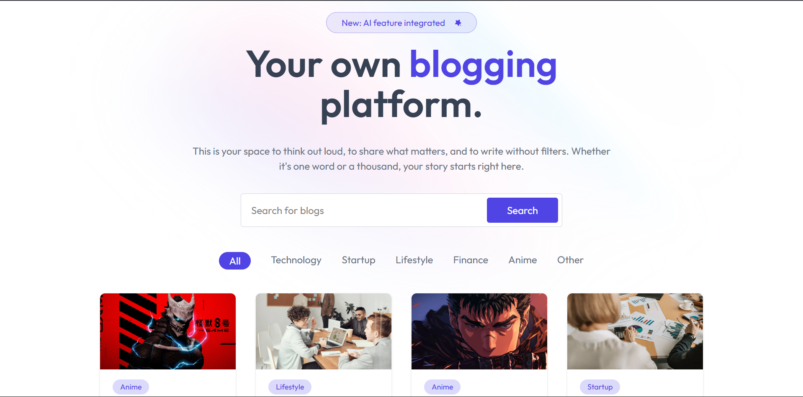
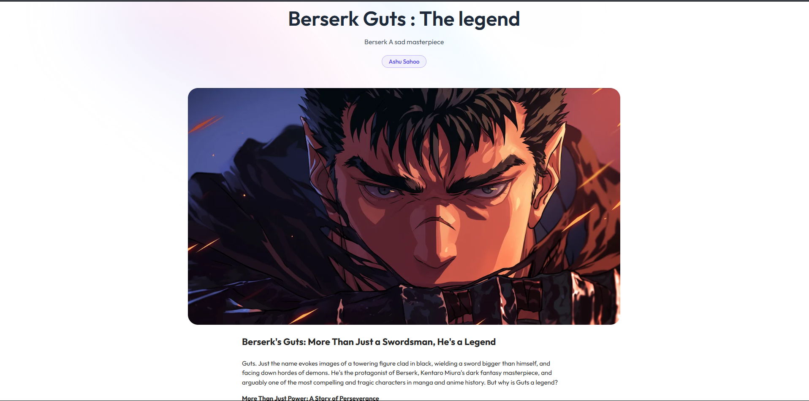
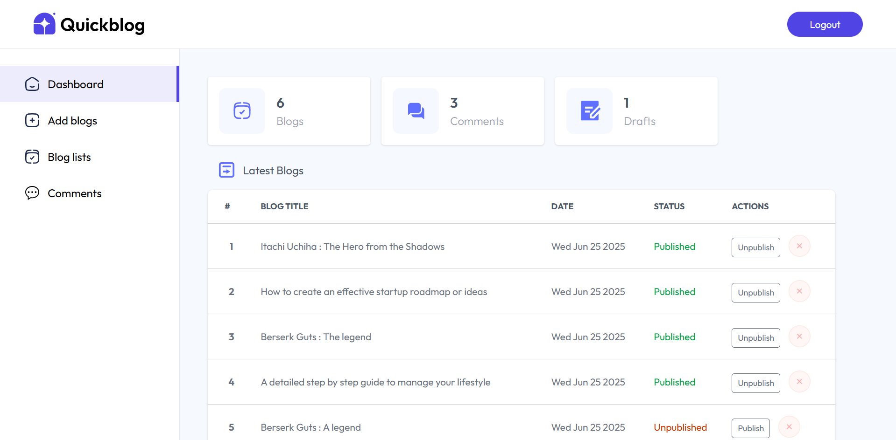

# ✍️ Quickblog – AI-Powered Blogging Platform

A modern, full-stack **MERN** blog application that leverages **AI-powered content generation** to help users create engaging posts effortlessly.

## 🚀 Key Features

- 🔐 **JWT Authentication**
  - Secure user signup, login, and session management.

- 🤖 **AI-Driven Content Generation**
  - Integrated **Gemini API** to assist users in generating blog post content automatically.

- 📝 **Post Management**
  - Create, edit, publish, and delete posts.
  - Filter and search posts by keywords or categories.
  - Enable user comments for interactive discussions.

- 📱 **Responsive UI**
  - Mobile-friendly design crafted using **Tailwind CSS** for smooth user experience across devices.

## 🛠️ Tech Stack

- **Frontend:** React.js, Tailwind CSS, Axios
- **Backend:** Express.js, Node.js
- **Database:** MongoDB
- **Authentication:** JWT (JSON Web Tokens)
- **AI Integration:** Gemini API for content generation

## 🔗 Live Demo

👉 [Quickblog.live](https://quick-blog-eosin.vercel.app/)  

## 📸 Preview

###  Home Page

###  Blog

###  Admin Dashboard

## 📬 Contact

If you're interested in the implementation or want to discuss this project, feel free to reach out via [LinkedIn](https://www.linkedin.com/in/ashutosh-sahoo-32067b110/) or email at `ashutoshsahoo1985@gmail.com`.

---

